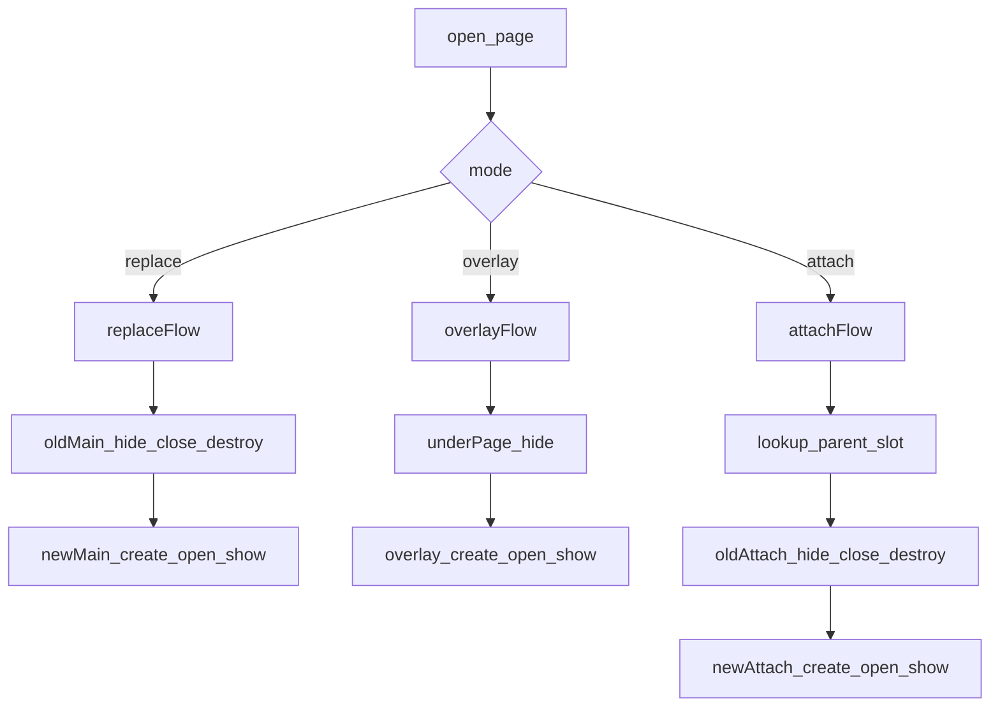

# UI 生命周期与页面编排蓝图（落地接口级）

## 目标与边界
- 建立统一 UI 编排入口，避免业务侧直接 `add_child`/`change_scene_to_packed` 导致生命周期不一致。
- 明确三种模式：`replace`（替换主页面）、`overlay`（覆盖层）、`attach`（父页面挂载子页面）。
- `attach` 默认采用“每次重建”策略：切换时旧实例销毁，新实例重建。
- 保持与现有 MVC 结构兼容：不改 `ControllerManager` 职责，只把 UI 生命周期收口到 `UIManager`。

## 目标文件（设计落点）
- 新增基类：[`e:/GodotGames/SANHAI/src/core/ui/BaseUI.gd`](e:/GodotGames/SANHAI/src/core/ui/BaseUI.gd)
- 新增管理器：[`e:/GodotGames/SANHAI/src/core/ui/UIManager.gd`](e:/GodotGames/SANHAI/src/core/ui/UIManager.gd)
- 新增注册表：[`e:/GodotGames/SANHAI/src/core/ui/UIRegistry.gd`](e:/GodotGames/SANHAI/src/core/ui/UIRegistry.gd)
- 新增根节点场景（层级容器）：[`e:/GodotGames/SANHAI/src/core/ui/UIRoot.tscn`](e:/GodotGames/SANHAI/src/core/ui/UIRoot.tscn)
- 接入点调整：[`e:/GodotGames/SANHAI/project.godot`](e:/GodotGames/SANHAI/project.godot)
- 首批迁移页面：[`e:/GodotGames/SANHAI/src/modules/startgame/view/StartGameScene.gd`](e:/GodotGames/SANHAI/src/modules/startgame/view/StartGameScene.gd), [`e:/GodotGames/SANHAI/src/modules/login/view/LoginPanel.gd`](e:/GodotGames/SANHAI/src/modules/login/view/LoginPanel.gd)
- 设计文档：[`e:/GodotGames/SANHAI/doc/UI_LIFECYCLE.md`](e:/GodotGames/SANHAI/doc/UI_LIFECYCLE.md)

## 生命周期模型（页面级）
- `on_page_create(params: Dictionary) -> void`：实例创建后调用一次。
- `on_page_open(params: Dictionary) -> void`：每次打开时调用。
- `on_page_show() -> void`：页面可见并可交互。
- `on_page_hide() -> void`：页面被遮挡或即将关闭。
- `on_page_close() -> void`：业务关闭阶段（可做状态落盘、请求取消）。
- `on_page_destroy() -> void`：对象销毁前最终清理。
- `_ready/_exit_tree` 只做 Godot 节点层初始化/清理，不承载业务流程编排。

## 模式语义与状态流
- `replace`：当前 main 页面 `hide -> close -> destroy`，新页面 `create -> open -> show`。
- `overlay`：当前 top 页面 `hide`（可选禁用输入），覆盖层 `create -> open -> show`；关闭覆盖层后下层 `show`。
- `attach(parent, slot)`（默认重建）：
  - 旧 attach（同 `parent+slot`）执行 `hide -> close -> destroy`。
  - 新 attach 执行 `create -> open -> show`，并挂到父页面指定 slot 容器。

## 接口设计（UIManager）
- `open_page(page_id: StringName, params: Dictionary = {}, mode: StringName = &"replace") -> BaseUI`
- `open_overlay(page_id: StringName, params: Dictionary = {}) -> BaseUI`
- `open_attach(parent_page_id: StringName, slot_id: StringName, page_id: StringName, params: Dictionary = {}) -> BaseUI`
- `switch_attach(parent_page_id: StringName, slot_id: StringName, page_id: StringName, params: Dictionary = {}) -> BaseUI`
- `close_page(page_instance_id: int) -> void`
- `close_top_overlay() -> void`
- `close_attach(parent_page_id: StringName, slot_id: StringName) -> void`

## 数据结构设计
- `page_registry: Dictionary[StringName, Dictionary]`
  - `scene_path`, `default_mode`, `layer`, `block_input`, `allow_multi_instance`。
- `main_page: BaseUI`：当前主页面实例。
- `overlay_stack: Array[BaseUI]`：覆盖层栈。
- `attach_map: Dictionary[StringName, BaseUI]`：key=`"parent:slot"`，value=当前 attach。
- `page_instance_index: Dictionary[int, BaseUI]`：按实例 id 快速关闭。

## 与当前工程的迁移策略
- 第一步只迁移登录链路：`StartGameScene` 不再直接实例化 `LoginPanel`，改为 `UIManager.open_page(LOGIN_PANEL, {}, replace)`。
- `LoginPanel` 不再直接 `change_scene_to_packed`，改为调用 `UIManager.open_page(HOME_TEST_PANEL, params, replace)`。
- 保持 `ControllerManager` 现有登录编排不变，先完成 UI 生命周期收口，再考虑控制器层解耦。

## 验证标准（按你当前关注点）
- 场景替换：切换页面时旧页生命周期完整触发且节点无残留。
- 弹窗覆盖：overlay 关闭后下层恢复 `show`，输入状态正确。
- attach 切换（重建）：同 slot 切换 A->B 时 A 必然销毁，B 必然新建。
- 父页关闭：所有 attach 级联 `close+destroy`，无悬挂引用。
- 日志可观测：每个页面生命周期阶段有统一 debug 日志。

## 风险与约束
- 迁移期会有“新旧入口并存”风险，必须禁用业务侧直连 `change_scene_to_packed`。
- attach 默认重建会增加实例化成本，后续可按页面白名单升级为可缓存策略。
- 页面脚本需要统一继承 `BaseUI`，存在一次性改造成本。
